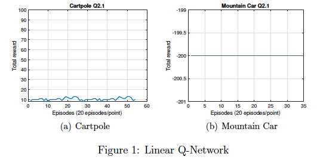
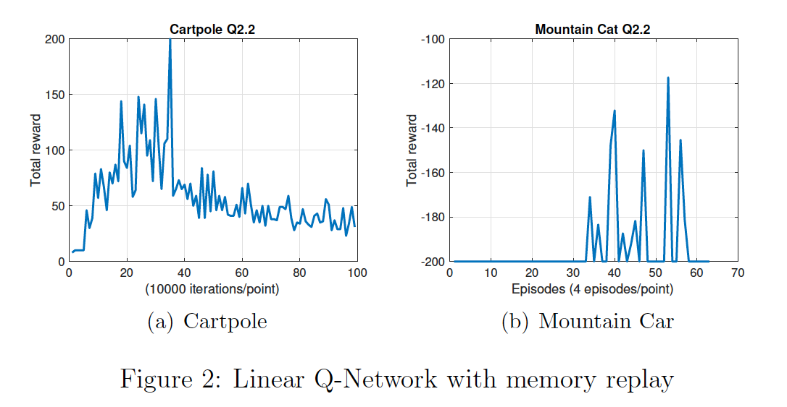
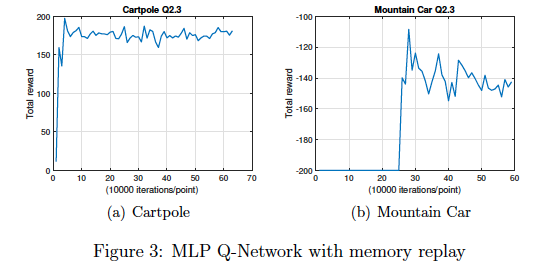
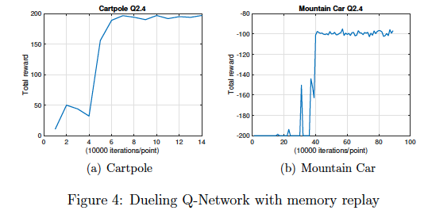

# Deep Q Network to solve MountainCar/CartPole
The repository explores  an  alternative  to  the  model-based  learning,  i.e.   model-free  learning. In particular, I implement a version of TD learning called Q-learning.

I work with the OpenAI Gym environments for MoutainCar (MC) and CartPole (CP), and train a Q-network from state inputs on a gym environment. This will be a demonstration of some of the techniques (memory replay, freezing weight, dueling Q network, etc) that were found to be important in practice to stabilize training and achievebetter performance


## Linear Q-network with Online Learning 

For CartPole training, execute:

```python3 DQN_linear.py --env='CartPole-v0' --render=0 --train=1```

For MountainCar training, execute:

```python3 DQN_linear.py --env='MountainCar-v0' --render=0 --train=1```

for testing with save model

```python3 DQN_linear.py --env='CartPole-v0' --render=1 --train=0 --model='save/<model name>'```


```python3 DQN_linear.py --env='MountainCar-v0' --render=1 --train=0 --model='save/<model name>'```


I implement a linear Q-network for both environments. The Linear network is 1 dense layer without activation and it has not experience replay. However, the network does not work well under these two environments. 

The main reason behind this problem is that the complexity of linear model is not able to handle non-linear environments. 

For example, the CartPole environment, the state given by OpenAI gym are positions and velocity of both cart and pole. The relationship between the pushing force and the angle of the pole plus the velocity cannot be represented by a linear function. So, in general, linear Q-network may not work well. But I observed that occasionally the reward (at the start of the training) can reach 30+ or even 150+. But it really depends on initial condition.

Also, without experience replay, it is easy to bias to a specific direction when training with a set of samples Figure 1 (a) shows no obvious improvements are made.

For MountainCar env, the reward is very sparse and may not be effectively handeled by Q-learning with linear network. One trick that helps with performance improvement under sparse reward is that in each update, the agent learn from immediate reward and mitigate long term Q value with small gamma (0.1). In this way, the reward will pose more effect on the update. With this, even though I did not see the change in total award in figure 1(b), but in video Q2.1-3, the agent appears to learning something and when removing the 200-step limitation, the car can reach the peak. Occasionally, the problem can be solved when initial condition is good.


Results:




## Linear Q-network with Memory Replay 

For CartPole training, execute:

```python3 DQN_linear_MR.py --env='CartPole-v0' --render=0 --train=1```

For MountainCar training, execute:

```python3 DQN_linear_MR.py --env='MountainCar-v0' --render=0 --train=1```

Then some keras model will be saved in the save folder

for testing with saved model

```python3 DQN_linear_MR.py --env='CartPole-v0' --render=1 --train=0 --model='save/<model name>'```

```python3 DQN_linear_MR.py --env='MountainCar-v0' --render=1 --train=0 --model='save/<model name>'```


With memory replay, the performance of CartPole have showed improvement in figure 2(a). For MountainCar, the agent still performs poorly. The reason is still due to the complexity of model that are not able to easily capture the dynamics of environment and the sparse reward. I have tried to use different initializer of kernel weights. It does not improve a lot.

The reason why CartPole improves is that the experience replay can break the bias to a specific direction when training with a set of samples. With mitigated bias, even though the linear cannot capture complexity of the environment, the performance indeed improves. But convergence is poor. Between 200,000 and 400,000, I can see clear improvement, but after that, the policy decays.

The MountainCar may still receive some benefit from the replay. I can occasionally see the successful policy being learned within reasonable training time. Again, I use immediate reward by changing the value of gamma to mitigate sparse reward issue. Also, I increase the burn-in size (50,000) and memory size (100,000) and the epsilon starts from 1 to increase randomness. Learning rate is 1 to increase the immediate reward effect. With those settings, I can see some successful policy at some training point. But if I continue the training, I lose the optimal policy.


Results:




## Deep Q-network with Memory Replay

For CartPole training, execute:

```python3 DQN_Deep_Q.py --env='CartPole-v0' --render=0 --train=1```

For MountainCar training, execute:

```python3 DQN_Deep_Q.py --env='MountainCar-v0' --render=0 --train=1```

Test and visuallize

```python3 DQN_Deep_Q.py --env='CartPole-v0' --render=1 --train=0 --model='save/<model name>'```

```python3 DQN_Deep_Q.py --env='MountainCar-v0' --render=1 --train=0 --model='save/<model name>'```

exp:

```python3 DQN_Deep_Q.py --env='CartPole-v0' --render=1 --train=0 --model='save/CartPole-v0.h5'```


NOTE: if the loss explodes to more than 10e5, stop and re-run it. Otherwise, it still has good chance to reduce and converge


In MLP case, the kernel weights initializer and learning rate schedule play important roles on performance. I have tested random normal initializer and Glorot normal initializer. The Glorot normal initializer has better performance since it optimizes for input distribution.

Learning rate schedule helps us to stay in good weights once I explore to these points. In our setting, I initially set the learning rate 0.001 for mountainCar and 0.00035 for CartPole. If I run into some good policies during testing, then I will shrink the learning rate by halving it until it reaches 0.0001. By doing so, the weights will not change a lot after update. In a non-linear model, this kind of learning rate schedule usually works well.  


From the experimental results, the number of hidden units at each layer seems not have to be unnecessarily large. Too large may cause gradient explosion that may make model very unstable. In our setting, I was using 15,20,10 at each hidden layer. With memory replay and target network (double Q learning), the loss is kept under a small amount of value and I can have a better performance. 

Overall, the Deep Q-network shows good ability to converge and at the end of the evolution in the figures the agent perform reasonably well in each episode. The MountainCar env takes 250,000 iterations to start responding and reaches the score of -140. The CartPole case takes 20,000 iterations to improve and converge to about 185 .


Results:



## Dueling Q-network with Memory Replay

For CartPole training, execute:

```python3 DQN_duelling_Deep_Q.py --env='CartPole-v0' --render=0 --train=1```

For MountainCar training, execute:

```python3 DQN_duelling_Deep_Q.py --env='MountainCar-v0' --render=0 --train=1```

Test and visuallize

```python3 DQN_duelling_Deep_Q.py --env='CartPole-v0' --render=1 --train=0 --model='save/<model name>'```

```python3 DQN_duelling_Deep_Q.py --env='MountainCar-v0' --render=1 --train=0 --model='save/<model name>'```

NOTE: if the loss explodes to more than 10e5, stop and re-run it. Otherwise, it still has good chance to reduce and converge

With dueling architecture, I can find that the convergence rate for Cartpole become larger. In Question 2.3, it takes 200,000 iterations to achieve stable performance. However, it takes approximately 100,000 iterations to achieve stable reward with dueling network. The CartPole takes about 60,000 iterations to start reaching the top score.

Due to the sparse reward, the stable performance of MountainCar usually depends on how long it gets to flag for first time. The time it takes is related to learning rate schedule and hyperparameters. After the agent gets to flag, I can find that the dueling deep Q-network is able to stabilize the performance better than deep Q-network. The MountainCar case takes about 350,000 iterations to start constantly increasing and improve to solve the MDP quickly and efficiently.

The experimental results shows that by adding two stream to the network, the learning becomes more stable and finally stablizes at higher award. Other technique including learning scheduling, weight fixing and experience replay are used here to achieve higher score.


Results:




