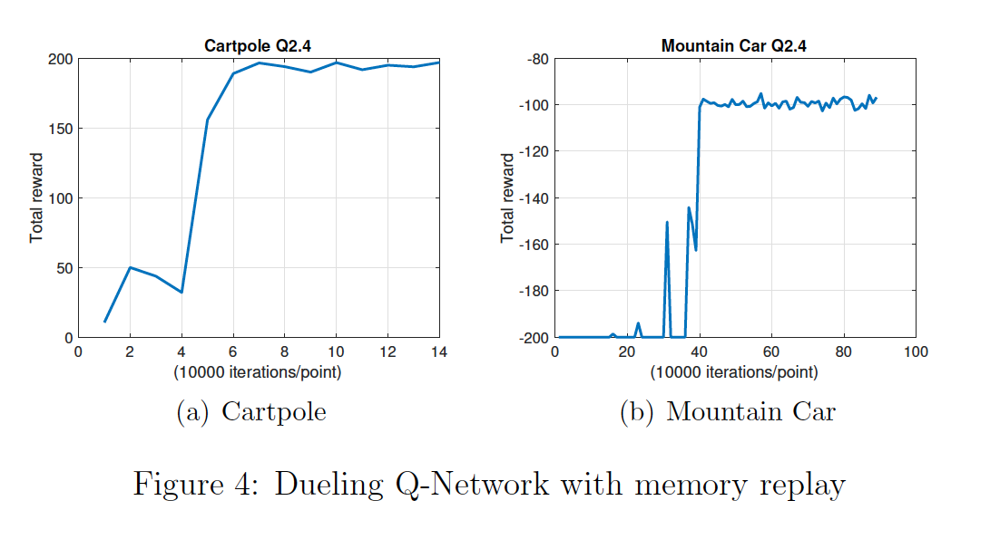

# Deep Q Network to solve MountainCar/CartPole
The repository explores  an  alternative  to  the  model-based  learning,  i.e.   model-free  learning. In particular, I implement a version of TD learning called Q-learning.

I work with the OpenAI Gym environments for MoutainCar (MC) and CartPole (CP), and train a Q-network from state inputs on a gym environment. This will be a demonstration of some of the techniques (memory replay, freezing weight, dueling Q network, etc) that were found to be important in practice to stabilize training and achievebetter performance


## Linear Q-network with Online Learning 

For CartPole training, execute:

```python3 DQN_linear.py --env='CartPole-v0' --render=0 --train=1```

For MountainCar training, execute:

```python3 DQN_linear.py --env='MountainCar-v0' --render=0 --train=1```

for testing with save model

```python3 DQN_linear.py --env='CartPole-v0' --render=1 --train=0 --model='save/<model name>'```


```python3 DQN_linear.py --env='MountainCar-v0' --render=1 --train=0 --model='save/<model name>'```

Results:
{:height="50%" width="50%"}


## Linear Q-network with Memory Replay 

For CartPole training, execute:

```python3 DQN_linear_MR.py --env='CartPole-v0' --render=0 --train=1```

For MountainCar training, execute:

```python3 DQN_linear_MR.py --env='MountainCar-v0' --render=0 --train=1```

Then some keras model will be saved in the save folder

for testing with saved model

```python3 DQN_linear_MR.py --env='CartPole-v0' --render=1 --train=0 --model='save/<model name>'```

```python3 DQN_linear_MR.py --env='MountainCar-v0' --render=1 --train=0 --model='save/<model name>'```

Results:


## Deep Q-network with Memory Replay

For CartPole training, execute:

```python3 DQN_Deep_Q.py --env='CartPole-v0' --render=0 --train=1```

For MountainCar training, execute:

```python3 DQN_Deep_Q.py --env='MountainCar-v0' --render=0 --train=1```

Test and visuallize

```python3 DQN_Deep_Q.py --env='CartPole-v0' --render=1 --train=0 --model='save/<model name>'```

```python3 DQN_Deep_Q.py --env='MountainCar-v0' --render=1 --train=0 --model='save/<model name>'```

exp:

```python3 DQN_Deep_Q.py --env='CartPole-v0' --render=1 --train=0 --model='save/CartPole-v0.h5'```


NOTE: if the loss explodes to more than 10e5, stop and re-run it. Otherwise, it still has good chance to reduce and converge

Results:
{:height="50%" width="50%"}

## Dueling Q-network with Memory Replay

For CartPole training, execute:

```python3 DQN_duelling_Deep_Q.py --env='CartPole-v0' --render=0 --train=1```

For MountainCar training, execute:

```python3 DQN_duelling_Deep_Q.py --env='MountainCar-v0' --render=0 --train=1```

Test and visuallize

```python3 DQN_duelling_Deep_Q.py --env='CartPole-v0' --render=1 --train=0 --model='save/<model name>'```

```python3 DQN_duelling_Deep_Q.py --env='MountainCar-v0' --render=1 --train=0 --model='save/<model name>'```

NOTE: if the loss explodes to more than 10e5, stop and re-run it. Otherwise, it still has good chance to reduce and converge

Results:
{:height="50%" width="50%"}


