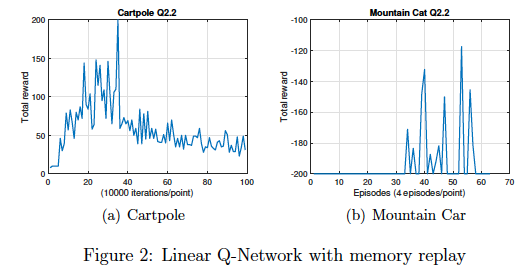

# Deep Q Network to solve MountainCar/CartPole
The repository explores  an  alternative  to  the  model-based  learning,  i.e.   model-free  learning. In particular, I implement a version of TD learning called Q-learning.

I work with the OpenAI Gym environments for MoutainCar (MC) and CartPole (CP), and train a Q-network from state inputs on a gym environment. This will be a demonstration of some of the techniques (memory replay, freezing weight, dueling Q network, etc) that were found to be important in practice to stabilize training and achievebetter performance


## Linear Q-network with Online Learning 

For CartPole training, execute:

```python3 DQN_linear.py --env='CartPole-v0' --render=0 --train=1```

For MountainCar training, execute:

```python3 DQN_linear.py --env='MountainCar-v0' --render=0 --train=1```

for testing with save model

```python3 DQN_linear.py --env='CartPole-v0' --render=1 --train=0 --model='save/<model name>'```


```python3 DQN_linear.py --env='MountainCar-v0' --render=1 --train=0 --model='save/<model name>'```


I implement a linear Q-network for both environments. The Linear network is 1 dense layer without activation and it has not experience replay. However, the network does not work well under these two environments. 

The main reason behind this problem is that the complexity of linear model is not able to handle non-linear environments. 

For example, the CartPole environment, the state given by OpenAI gym are positions and velocity of both cart and pole. The relationship between the pushing force and the angle of the pole plus the velocity cannot be represented by a linear function. So, in general, linear Q-network may not work well. But we observed that occasionally the reward (at the start of the training) can reach $>30$ or even $>150$. But it really depends on initial condition.

Also, without experience replay, it is easy to bias to a specific direction when training with a set of samples Figure 1 (a) shows no obvious improvements are made.

For MountainCar env, the reward is very sparse and may not be effectively handeled by Q-learning with linear network. One trick that helps with performance improvement under sparse reward is that in each update, the agent learn from immediate reward and mitigate long term Q value with small gamma (0.1). In this way, the reward will pose more effect on the update. With this, even though we did not see the change in total award in figure 1(b), but in video Q2.1-3, the agent appears to learning something and when removing the 200-step limitation, the car can reach the peak. Occasionally, the problem can be solved when initial condition is good.


Results:


## Linear Q-network with Memory Replay 

For CartPole training, execute:

```python3 DQN_linear_MR.py --env='CartPole-v0' --render=0 --train=1```

For MountainCar training, execute:

```python3 DQN_linear_MR.py --env='MountainCar-v0' --render=0 --train=1```

Then some keras model will be saved in the save folder

for testing with saved model

```python3 DQN_linear_MR.py --env='CartPole-v0' --render=1 --train=0 --model='save/<model name>'```

```python3 DQN_linear_MR.py --env='MountainCar-v0' --render=1 --train=0 --model='save/<model name>'```

Results:




## Deep Q-network with Memory Replay

For CartPole training, execute:

```python3 DQN_Deep_Q.py --env='CartPole-v0' --render=0 --train=1```

For MountainCar training, execute:

```python3 DQN_Deep_Q.py --env='MountainCar-v0' --render=0 --train=1```

Test and visuallize

```python3 DQN_Deep_Q.py --env='CartPole-v0' --render=1 --train=0 --model='save/<model name>'```

```python3 DQN_Deep_Q.py --env='MountainCar-v0' --render=1 --train=0 --model='save/<model name>'```

exp:

```python3 DQN_Deep_Q.py --env='CartPole-v0' --render=1 --train=0 --model='save/CartPole-v0.h5'```


NOTE: if the loss explodes to more than 10e5, stop and re-run it. Otherwise, it still has good chance to reduce and converge

Results:


## Dueling Q-network with Memory Replay

For CartPole training, execute:

```python3 DQN_duelling_Deep_Q.py --env='CartPole-v0' --render=0 --train=1```

For MountainCar training, execute:

```python3 DQN_duelling_Deep_Q.py --env='MountainCar-v0' --render=0 --train=1```

Test and visuallize

```python3 DQN_duelling_Deep_Q.py --env='CartPole-v0' --render=1 --train=0 --model='save/<model name>'```

```python3 DQN_duelling_Deep_Q.py --env='MountainCar-v0' --render=1 --train=0 --model='save/<model name>'```

NOTE: if the loss explodes to more than 10e5, stop and re-run it. Otherwise, it still has good chance to reduce and converge

Results:


